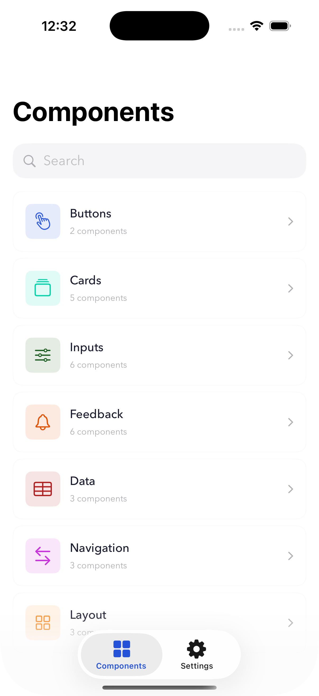
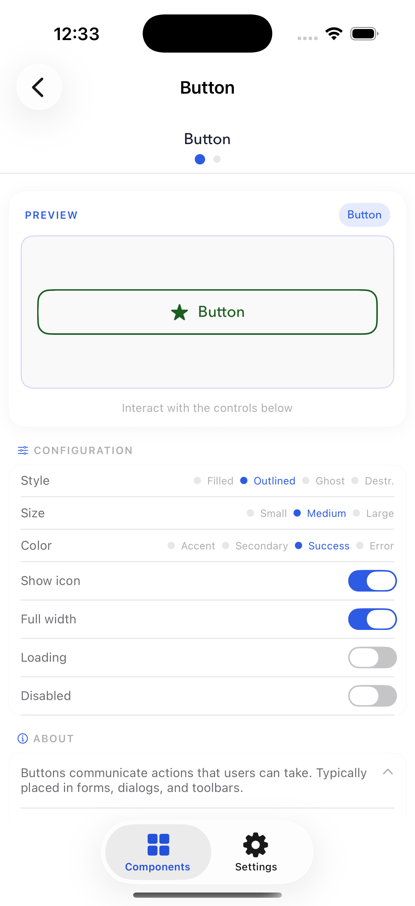
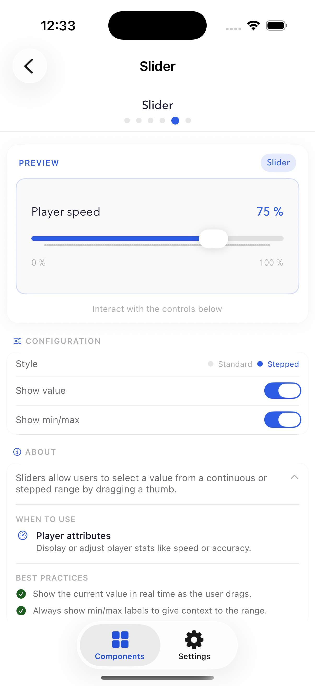
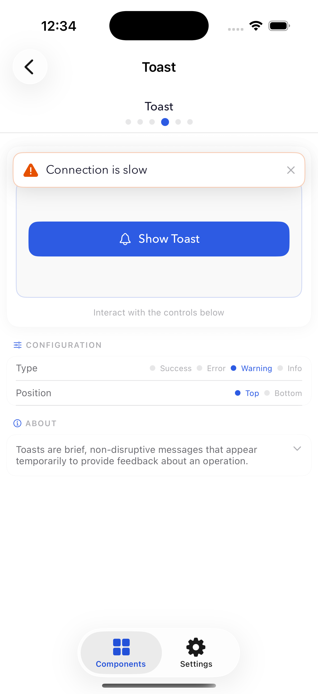
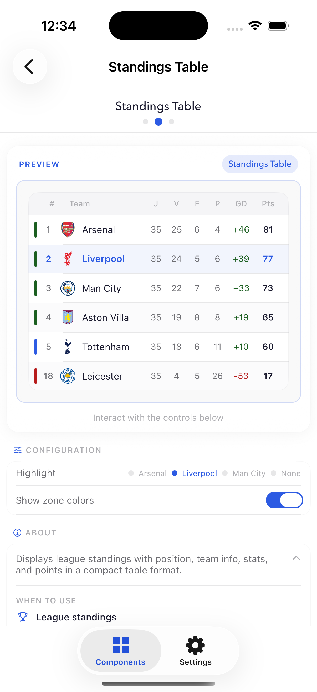
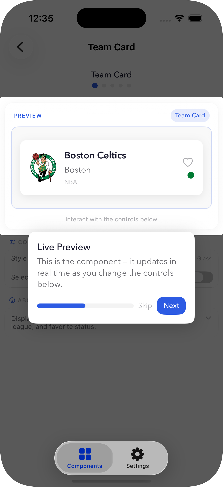
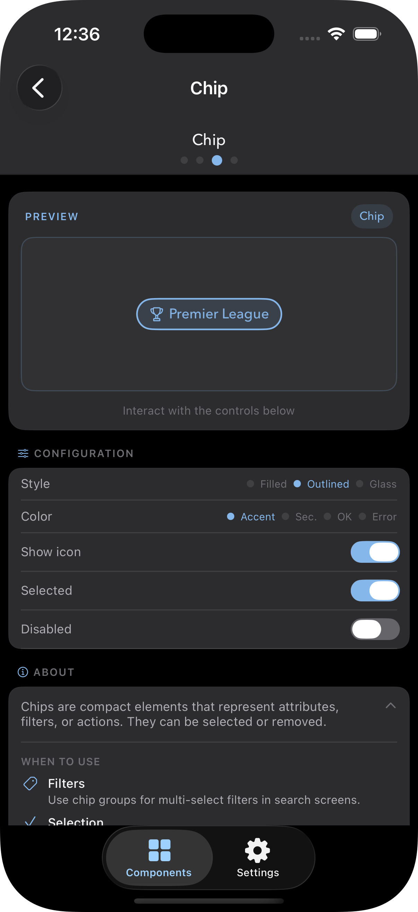
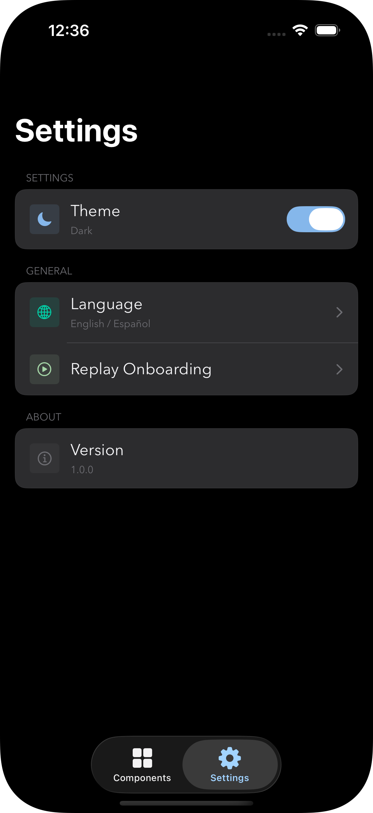

# SportShowcase 🏅

App iOS construida con SwiftUI que presenta un Design System personalizado a través de un playground de componentes interactivo. Explora, configura y aprende sobre cada componente de UI usando datos reales de fútbol, basketball y tenis.

---

## Capturas de pantalla

| Catálogo | Button Playground | Slider + About |
|:-:|:-:|:-:|
|  |  |  |

| Toast | Standings Table | CoachMark |
|:-:|:-:|:-:|
|  |  |  |

| Dark Mode | Settings |
|:-:|:-:|
|  |  |

---

## Funcionalidades

- 🎨 Design System personalizado con tokens centralizados (color, tipografía, espaciado, radio)
- 🧩 28+ componentes de UI organizados en 7 categorías
- 🕹️ Playground interactivo — configura cada componente en tiempo real
- 📖 Documentación integrada por componente (escenarios de uso, mejores prácticas)
- 🌍 Soporte completo de localización (Inglés / Español)
- 🌙 Soporte de Dark Mode
- 🏀⚽🎾 Datos deportivos reales (Fútbol, Basketball, Tenis) via SwiftData
- 🧭 Sistema de onboarding con CoachMark

---

## Design System

El Design System está construido sobre tokens de diseño centralizados:

```
Core/DesignSystem/
├── Tokens/
│   ├── DSColor       # Colores semánticos con variantes light/dark
│   ├── DSFont        # Escala tipográfica (Avenir Next)
│   ├── DSSpacing     # Escala de espaciado (xs → xxl)
│   └── DSRadius      # Tokens de radio de esquinas
├── Components/
│   ├── Button/       # DSButton, DSSlideToConfirmButton
│   ├── Card/         # DSCard, DSTeamCard, DSPlayerCard, DSMatchCard, DSStatCard
│   ├── Input/        # DSTextField, DSSearchBar, DSToggle, DSStepper, DSSlider, DSPicker
│   ├── Feedback/     # DSLoader, DSProgressBar, DSSkeleton, DSToast, DSAlert, DSEmptyState
│   ├── Layout/       # DSAvatar, DSDivider, DSChip, DSBadge
│   ├── Data/         # DSList, DSStandingsTable, DSGrid
│   ├── Navigation/   # DSSegmentedControl, DSPageIndicator, DSBreadcrumb
│   └── Onboarding/   # DSCoachMark
└── Extensions/       # Color+Hex, View+Modifiers
```

---

## Arquitectura

```
SportShowcase/
├── App/                        # Punto de entrada, ciclo de vida
├── Core/
│   ├── DesignSystem/           # Tokens, componentes, extensiones
│   ├── Localization/           # String catalog (EN/ES), enum L10n
│   └── Theme/                  # ThemeManager (light/dark/system)
├── Domain/
│   └── Models/                 # Team, Player, Match, League (@Model SwiftData)
├── Data/
│   ├── Seed/                   # SeedService — JSON → SwiftData en primer arranque
│   └── SwiftData/              # DatabaseContainer
└── Presentation/
    ├── Catalog/                # CatalogView, MainTabView, RootView, SidebarView, NavigationRouter
    ├── Components/             # Vistas showcase por categoría (patrón playground)
    ├── Screens/                # SettingsView
    └── Shared/                 # ComponentPlaygroundView, PlaygroundControls
```

### Decisiones técnicas

**Patrón Component Playground**  
Cada categoría de componentes tiene una pantalla dedicada construida sobre `ComponentPlaygroundView<Preview, Controls>` — una vista genérica que renderiza un área de preview en vivo, un panel de configuración compacto y una sección About colapsable. Los 28 componentes comparten la misma estructura.

**Sistema de tokens de diseño**  
Todas las propiedades visuales (colores, fuentes, espaciado, radio) están definidas como tokens estáticos en la capa `Core/DesignSystem/Tokens`. Los componentes nunca usan valores directos — siempre referencian un token. Esto hace que todo el Design System sea configurable desde una única fuente de verdad.

**SwiftData para datos de demostración**  
Los datos deportivos (equipos, jugadores, partidos) se cargan desde archivos JSON en el primer arranque via `SeedService`. Componentes como `DSTeamCard`, `DSStandingsTable` y `DSGrid` usan `@Query` para mostrar datos persistidos reales en lugar de mocks hardcodeados — demostrando la integración de SwiftData con componentes SwiftUI.

**Localización con String Catalog**  
Todos los strings visibles al usuario se gestionan a través de un `.xcstrings` String Catalog con traducciones en inglés y español. Los strings se acceden via un enum tipado `L10n` organizado por feature (General, Catalog, Playground, CoachMark, Settings, etc.).

**Sistema CoachMark**  
`DSCoachMarkManager` es un singleton `@Observable` que gestiona un overlay de onboarding a pantalla completa. Usa `PreferenceKey` de SwiftUI para reportar los frames de los elementos desde cualquier punto de la jerarquía, y un `TimelineView` para re-renderizar cuando cambia el estado. La capa de oscurecimiento usa `Canvas` con `blendMode: .clear` para recortar el elemento destacado.

---

## Stack tecnológico

| | |
|---|---|
| Lenguaje | Swift 5.9 |
| UI | SwiftUI |
| Persistencia | SwiftData |
| Arquitectura | MVVM + Clean Architecture (ligera) |
| iOS mínimo | 18.0 |
| Xcode | 26.2 |

---

## Cómo ejecutar

1. Clona el repositorio:
```bash
git clone https://github.com/jcreyesDev/SportShowcase.git
```

2. Abre en Xcode:
```bash
cd SportShowcase
open SportShowcase.xcodeproj
```

3. Selecciona un simulador (iPhone, iOS 18+) y presiona **⌘R**

No se requiere configuración adicional. Los datos deportivos están incluidos como JSON y se cargan en SwiftData en el primer arranque.

---

## Autor

Desarrollado por [@jcreyesDev](https://github.com/jcreyesDev)
